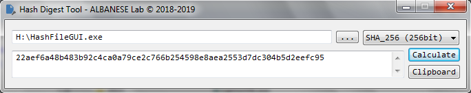

# Hash Digest Tool GUI

#### HashFile Graphical User Interface

This tool was written for educational purposes and to check the integrity of my softwares (at Windows machines).

 </img>

Visit: [ALBANESE Lab: Pojects](http://albanese.atwebpages.com/projects.php)

## License

This project is licensed under the ISC License.

##### Commercial-Grade Reliability. Copyright (c) 2018-2022 ALBANESE Research Lab.
